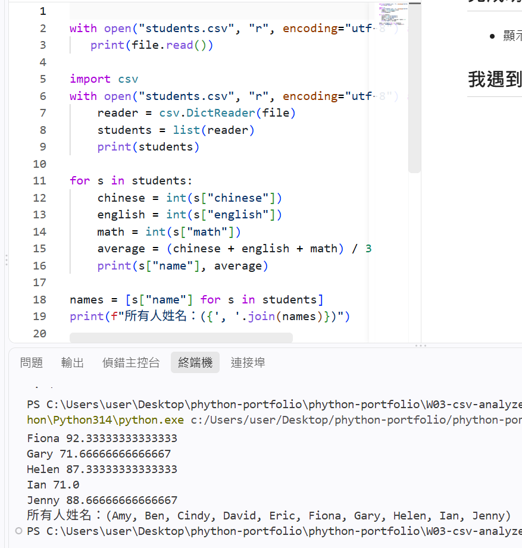

# 第三周學習紀錄

# Class CSV Analyzer
## 我做了什麼
使用 Python 讀取 CSV 班級資料，並進行成績分析。
## 使用技術
- Python / CSV / csv.DictReader / list / dictionary / for / if
## 完成功能
- 顯示學生資料 / 計算平均 / 找出最高分
## 執行結果

## 我遇到的問題與解決方式
問題：剛開始計算平均分數時直接拿 CSV 讀出來的資料相加，結果程式報錯。

解決方式：後來發現從 CSV 檔讀取出來的成績資料都是「字串（str）」格式，不能直接進行數學加減，所以加上 int() 將字串轉換成整數後，就能順利計算平均值了。